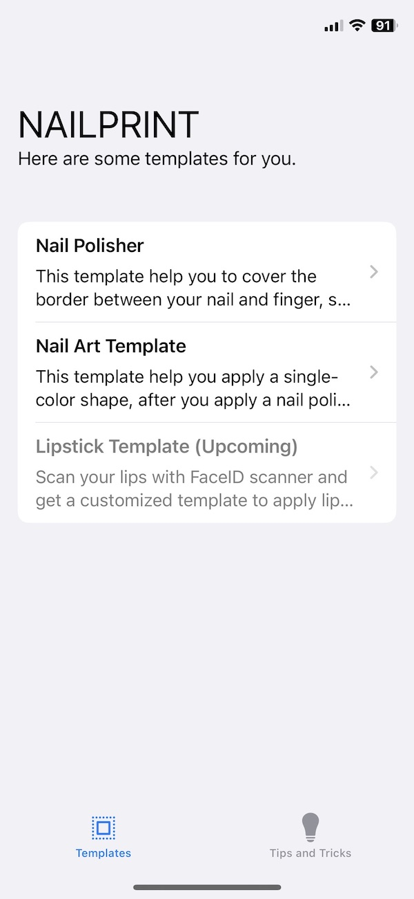

# Nailprint

Nailprint is a hackathon project which aims to help the visually impaired by providing easy-to-use templates where they need to apply beauty and care products.

Nailprint includes customizable templates for nail polishing and nail art. To inspire further projects, lipstick and otheer templates can be considered too. Under this idea, the popularity of Lidar TOF scanners in smartphones can be consideres. (Current Lidar resolution was not good enough to scan nail geometry.)

## Features

1. 2 Templates Included.
1. A content page included for tips and tricks.
1. Nail polish template can be customized with a hand photo.
1. Supports different skin colors. (Only contast or lightning may be required.)
1. On demand 3D-printable (.STL) file creation
1. Blazing-fast template creation/customization _(tested on M-series Macs and Linux environments)_

| Onboarding Screen | Templates Tab | Tips and Tricks Tab |
| ------------- | ------------- | ------------- |
|  |  |  |

| Template Detail Page | Get Template Section | Options |
| ------------- | ------------- | ------------- |
|  |  |  |

## How Does it Work?

- After client application sends hand photo, backend side process the image with Mediapipe and OpenCV libraries.
- Backend draws the contours of the nail and with Scipy library, best fitting curve will be generated based on a 2nd degree polynomic approximaiton. _(There is two possibility to define nail countours: a sinus based equation or parabol-based equation)_
- According to the parabolic best fitting curve PyMesh draws a combined STL file and backend sends this data to the client.
- Client provides and interface to user interaction.

| Hand Photo | Contour Detected | Equations Formed | STL Created |
| ------------- | ------------- | ------------- | ------------- |
|  |  | `ax^2 + bx + c = 0` _for each nail_ |  |


## How to Run

This repo includes two submodules.

`nailprint-ios` module contains iOS client application. It can be build with Xcode without any special configuration or library requirement. It doesn't require a specific Capability which requires developer account. You can build with only your Apple ID.

`nailprint-backend` is a Python 3 service. You shoud install the requirements as below;

```pip3 install -r requirements.txt```

_Please note that `mediapipe` library is not supported in MAC M-series. So you should comment this library in `requirements.txt` file and uncomment `mediapipe-silicon` line._

After the installation flask app can be runned with the prompt below.

`flask --app server run --host=0.0.0.0 -p 3030`

Please note that, iOS app, directly looking to the machine ip. So please update ip address in `CustomizePage.swfit` file, `getCustomizedTemplate` method.